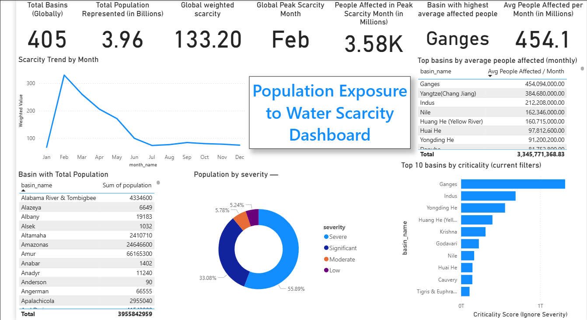

🌍 Population Exposure to Water Scarcity (1996–2005)
Short Description

An interactive Power BI dashboard analyzing global population exposure to varying levels of water scarcity between 1996 and 2005. The project highlights patterns, critical basins, and severity levels to provide insights into global water resource challenges.

🛠 Tech Stack

Power BI – Data visualization & dashboard creation

Power Query – Data cleaning & transformation

DAX (Data Analysis Expressions) – Custom measures & calculations

SQL (basic) – Data preparation & validation

📊 Data Source

Dataset sourced from Kaggle:
[Global Population Exposed to Water Scarcity (1996–2005)](https://www.kaggle.com/datasets/mpwolke/cusersmarildownloadsscarcitycsv/data)

🚰 Features & Highlights
Problem

Water scarcity is a growing global concern, with millions exposed to varying severity levels each year. Policymakers, researchers, and environmentalists need insights into historical scarcity patterns to drive effective planning and resource allocation.

Goal

To create a data-driven, interactive dashboard that visualizes global water scarcity trends, identifies high-risk basins, and quantifies populations affected by severity levels.

Key Visual Walkthrough

KPI Cards – Show total exposed population (in billions), severity frequency counts, and peak scarcity years.

Map-Based Visuals – Highlight geographical distribution of scarcity by basin.

Heatmaps – Display month-by-month severity variations across basins.

Ranking Table – Identifies Top 10 most critical basins based on population and severity (e.g., Yongding He in China, Yaqui in Mexico).

Severity Distribution Charts – Break down total exposure across four severity categories (Low, Moderate, Significant, Severe).

Impact & Insights

Revealed that billions were exposed to some form of scarcity during the 1996–2005 period.

Identified regions with recurring severe scarcity, supporting risk-based basin prioritization.

Provided an analytical foundation for policy development, water conservation strategies, and climate resilience planning.

📸 Dashboard Screenshot

waqas

# 🌍 Population Exposure to Water Scarcity (1996–2005)

### Short Description  
An interactive **Power BI dashboard** analyzing global population exposure to varying levels of water scarcity between 1996 and 2005. The project highlights patterns, critical basins, and severity levels to provide insights into global water resource challenges.  

---

### 🛠 Tech Stack  
- **Power BI** – Data visualization & dashboard creation  
- **Power Query** – Data cleaning & transformation  
- **DAX (Data Analysis Expressions)** – Custom measures & calculations  
- **SQL (basic)** – Data preparation & validation  

---

### 📊 Data Source  
Dataset sourced from Kaggle:  
👉[Global Population Exposed to Water Scarcity (1996–2005)](https://www.kaggle.com/datasets/mpwolke/cusersmarildownloadsscarcitycsv/data)

---

### 🚰 Features & Highlights  

#### **Problem**  
Water scarcity is a growing global concern, with millions exposed to varying severity levels each year. Policymakers, researchers, and environmentalists need insights into historical scarcity patterns to drive effective planning and resource allocation.  

#### **Goal**  
To create a **data-driven, interactive dashboard** that visualizes global water scarcity trends, identifies high-risk basins, and quantifies populations affected by severity levels.  

#### **Key Visual Walkthrough**  
- **KPI Cards** – Show total exposed population (in billions), severity frequency counts, and peak scarcity years.  
- **Map-Based Visuals** – Highlight geographical distribution of scarcity by basin.  
- **Heatmaps** – Display month-by-month severity variations across basins.  
- **Ranking Table** – Identifies **Top 10 most critical basins** based on population and severity (e.g., Yongding He in China, Yaqui in Mexico).  
- **Severity Distribution Charts** – Break down total exposure across four severity categories (Low, Moderate, Significant, Severe).  

#### **Impact & Insights**  
- Revealed that billions were exposed to some form of scarcity during the 1996–2005 period.  
- Identified regions with recurring severe scarcity, supporting **risk-based basin prioritization**.  
- Provided an analytical foundation for **policy development, water conservation strategies, and climate resilience planning**.  

---

### 📸 Dashboard Screenshot  

  

